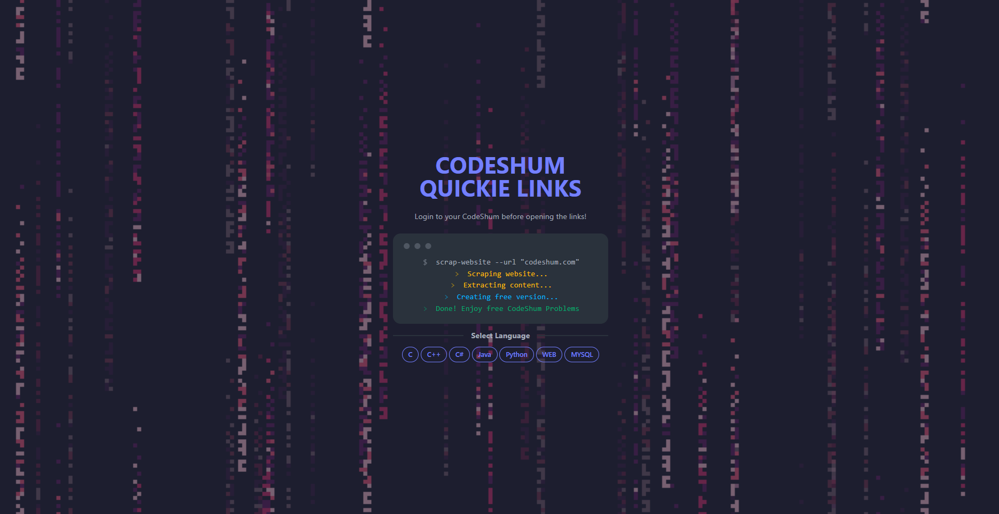

# CodeShum-Quickie-Problems

Welcome to **CodeShum Quickie Problems**, a curated directory of practice problems sourced from [codechum.com](https://codechum.com). Our goal is to provide direct links to publicly available practice problems, facilitating easy access for learners and coding enthusiasts. Please note that we do not host any content on our site.

<h1 align="center">
  
</h1>

## Features

- **Curated Problems**: Access a collection of handpicked practice problems.
- **Direct Links**: Navigate directly to the problem pages on codechum.com.
- **Categorized Listings**: Problems are organized by difficulty, topic, and type.

## Usage

1. **Browse Categories**: Navigate through the categories to find practice problems that suit your learning needs.
2. **Select a Problem**: Click on a problem to be redirected to the corresponding page on codechum.com.
3. **Practice and Learn**: Solve the problems directly on codechum.com and enhance your coding skills.

## Contribution

We welcome contributions from the community to expand and improve our directory. If you have any practice problems from codechum.com that you think should be included, feel free to submit them.

### How to Contribute

1. **Fork the Repository**: Create a fork of this repository.
2. **Add a Problem**: Add the problem details and the direct link in the appropriate category file.
3. **Create a Pull Request**: Submit a pull request with your additions.

## Disclaimer

CodeShum Quickie provides links to practice problems available on codechum.com. We do not claim ownership of the problems and are not responsible for any content hosted on codechum.com.

## Contact

If you have any questions, suggestions, or feedback, please feel free to reach out to us.

---

Thank you for using CodeShum Quickie! Happy coding!

